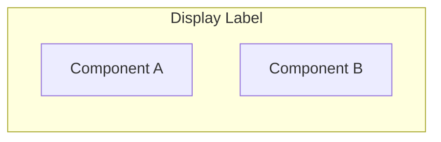

# Architecture Diagrams (Mermaid)

Help the user create clear, layered architecture diagrams using Mermaid syntax. The goal is to turn a codebase, design doc, or verbal description into a set of diagrams that tell the full story of a system's architecture.

## Reasoning Framework

This skill exists because architecture documentation is often outdated or nonexistent. It produces a consistent set of progressive-detail diagrams that can be embedded in product docs, technical specs, PRDs, or README files.

## Output Contract

| Artifact | Format | Handed to |
|----------|--------|-----------|
| 5 architecture diagrams | Mermaid code blocks | Product docs / technical specs / PRDs |
| Component summary table | Markdown table | Technical reviewers |

## How to Help

When the user asks for an architecture diagram:

1. **Gather context** -- Ask what system they want to diagram and what sources are available (codebase, docs, verbal description)
2. **Identify the tiers** -- Map the system to a layered model (Presentation, Application, Data is the default; adjust if the system doesn't fit)
3. **Inventory components** -- List every major component, service, database, queue, cache, and external integration
4. **Map connections** -- Identify how components communicate (protocols, sync/async, primary/fallback)
5. **Draft diagrams** -- Create a high-level overview first, then detail diagrams for each tier
6. **Add data flows** -- Document the key read and write paths through the system
7. **Create summary table** -- Produce a component reference table with tier, technology, and purpose

## VS Code Setup

Before the user can preview diagrams, they need a Mermaid viewer.

### Installing a Mermaid Previewer in VS Code

1. Open VS Code
2. Press `Cmd+Shift+X` (Mac) or `Ctrl+Shift+X` (Windows/Linux) to open Extensions
3. Search for **"Markdown Preview Mermaid Support"** (by Matt Bierner)
4. Click **Install**
5. Open any `.md` file containing a Mermaid code block
6. Press `Cmd+Shift+V` (Mac) or `Ctrl+Shift+V` (Windows/Linux) to open the Markdown preview
7. Mermaid diagrams will render automatically

**Alternative extensions:**
- **"Mermaid Markdown Syntax Highlighting"** -- Adds syntax highlighting inside mermaid code blocks
- **"Mermaid Editor"** -- Standalone Mermaid editor with live preview (search "Mermaid Editor" in extensions)

**Online preview:** Paste diagrams at [mermaid.live](https://mermaid.live/) for instant rendering without any install.

## Diagram Types to Produce

For a complete architecture document, create these diagrams in order:

### Diagram 1: High-Level Overview

A single `graph LR` showing all tiers as subgraphs with the major communication paths between them. This is the "one slide" view.

```
graph LR
    subgraph Presentation["Presentation Tier"]
        ...
    end
    subgraph Application["Application Tier"]
        ...
    end
    subgraph Data["Data Tier"]
        ...
    end
    Presentation -->|"protocol"| Application
    Application -->|"protocol"| Data
```

**Rules:**
- Use `graph LR` (left-to-right) for overview diagrams
- Each tier is a subgraph with a descriptive label
- Show only the top-level components in each tier (3-5 per tier max)
- Label edges with protocols and communication patterns
- Include fallback/alternative paths with distinct labels

### Diagram 2: Presentation Tier Detail

A `graph TB` (top-to-bottom) showing all client-side components, their internal structure, and how they connect outward.

**Include:**
- Web UI framework and key libraries (state management, design system, auth)
- Client SDKs with their internal evaluation logic
- Transport layers showing primary, alternative, and fallback paths
- Other client types (mobile, API consumers, service accounts)

### Diagram 3: Application Tier Detail

A `graph TB` showing the server-side processing layer.

**Include:**
- API layer (REST, GraphQL, gRPC)
- Authentication and authorization (SSO, API keys, RBAC roles)
- Business logic engines or domain services
- Event sourcing or CQRS patterns (inline vs. async projections)
- Background job processing (workers, schedulers, cron)
- External service integrations

### Diagram 4: Data Tier Detail

A `graph TB` showing all data stores and how they relate.

**Include:**
- Primary database(s) and their role (source of truth, event store, document store)
- Caching layers (in-memory, distributed)
- Message brokers and streaming platforms
- Object storage
- Write paths (who writes to each store)
- Read paths (who reads from each store, primary vs. fallback)

### Diagram 5 (Optional): Key Data Flows

For complex systems, create sequence diagrams or annotated flow descriptions for the critical paths:

- **Write path:** How changes propagate from user action to all data stores
- **Read path:** How clients get data, including fallback chains
- **Auth flow:** How authentication and authorization work end-to-end

## Mermaid Syntax Reference

### Subgraphs (for tiers and grouping)



### Node shapes

```
A["Rectangle"]        -- standard component
B("Rounded")          -- service or process
C[("Database")]       -- cylinder shape for databases
D(("Circle"))         -- external connection point
E{{"Hexagon"}}        -- decision or routing
```

### Edge labels

```
A -->|"Label"| B       -- solid arrow with label
A -.->|"Label"| B      -- dashed arrow (optional/fallback path)
A ==>|"Label"| B       -- thick arrow (primary/critical path)
A --- B                 -- line without arrow
```

### Styling tips

- Use `\n` for line breaks inside node labels: `A["Line 1\n(Line 2)"]`
- Keep labels concise -- full names go in the summary table, not the diagram
- Use consistent naming: uppercase for tiers, CamelCase for components, lowercase for protocols

## Component Summary Table

After the diagrams, always include a reference table:

```markdown
| Tier | Component | Technology | Purpose |
|------|-----------|-----------|---------|
| **1** | Component Name | Tech stack | What it does |
```

## Key Data Flows Section

After the table, document the critical paths in plain text with arrows:

```markdown
**Write Path (name):**
> Step 1 -> Step 2 -> Step 3 -> Step 4

**Read Path (name):**
> Primary source *(primary)* | Alternative *(fallback)* -> Local processing -> Output
```

## Questions to Ask Users

### If they have a codebase
- "What's the repo or project? Can I read the code, config files, and any existing docs?"
- "What are the main entry points? (API server, web app, CLI, SDK)"
- "What databases and external services does it connect to?"
- "Are there background jobs, workers, or async processing?"

### If they have a design doc
- "Can I read the doc? Where does it live?"
- "Is the doc current, or has the implementation diverged?"

### If they're describing verbally
- "Walk me through what happens when a user does [primary action]."
- "What are the main services and how do they talk to each other?"
- "Where does data live? What's the source of truth?"
- "Are there caching layers, message queues, or async patterns?"
- "What external services or APIs do you integrate with?"
- "How does authentication work?"

### For all approaches
- "Who is the audience for these diagrams? (Engineers, PMs, execs, new hires)"
- "Is there an existing architecture diagram I should improve on or replace?"
- "Are there any planned changes or migrations I should show as future state?"

## Common Mistakes to Flag

- **Too many components in the overview** -- The high-level diagram should have 3-5 items per tier, not every microservice. Detail goes in the tier-specific diagrams
- **Missing the data flow story** -- Diagrams show structure, but the reader also needs to understand how data moves through the system. Always include write/read path descriptions
- **Unlabeled edges** -- Every arrow should say what protocol, pattern, or data flows across it. An unlabeled arrow is ambiguous
- **Mixing abstraction levels** -- Don't put a database table name next to a tier-level subgraph. Keep each diagram at a consistent level of detail
- **Forgetting fallback and alternative paths** -- Production systems have primary and fallback paths. Show both with distinct edge styles (solid vs. dashed)
- **No summary table** -- Diagrams are visual but not searchable. The table makes the architecture greppable and serves as a legend

## Example Output Structure

```markdown
# [System Name] Architecture

## High-Level Overview
[Diagram 1: graph LR with tiers]

## Tier 1: Presentation Layer
[Diagram 2: graph TB with client components]

## Tier 2: Application Layer
[Diagram 3: graph TB with server components]

## Tier 3: Data Layer
[Diagram 4: graph TB with data stores]

## Key Data Flows
**Write Path:** ...
**Read Path:** ...

## Component Summary
| Tier | Component | Technology | Purpose |
|------|-----------|-----------|---------|
```

## Related Skills

- Writing Specs & Designs
- Technical Roadmaps
- Systems Thinking
